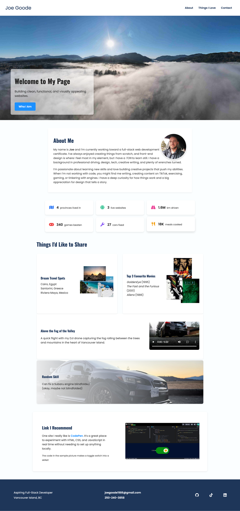

# Personal Page Upgrade

A refreshed personal webpage project designed to showcase my journey toward becoming a full-stack web developer. This page highlights my background, interests, skills, and includes a few personal touches like my travel goals, favourite movies, a drone video, and a link to a resource I recommend.

---

## Features

- **Hero Section:** Large background image with a semi-transparent welcome text box.
- **About Me:** Brief introduction with a rounded profile image for a personal touch.
- **Stats Row:** Quick facts displayed in a grid format for visual appeal.
- **Things I'd Like to Share:**  
  - Dream travel destinations with supporting images.  
  - Top 3 favourite movies with poster images.
  - A personal drone video showcasing the Port Alberni Valley.  
  - A random fun skill for personality.
- **Link I Recommend:** A highlighted link to CodePen with an image preview, making it easy for others to check out tools I like.
- **Responsive Design:** Layout adapts for different screen sizes while maintaining structure.

---

## Technologies Used

- **HTML5:** Semantic structure for accessibility and clean code.
- **CSS3:** Custom styling for all sections, flexbox/grid layout adjustments, and rounded image profiles.
- **Media Assets:** Custom-edited images and video clips for a personalized look and feel.

---

## Preview

---

## Future Improvements

- Improe the responsive design by starting with a mobile-first approach and scaling up for larger screens.
- Add an image carousel in the Share section for destinations and movies to make browsing smoother and more responsive.
- Adjust the profile picture positioning so it sits centred, overlapping the top "About" container for a cleaner look.